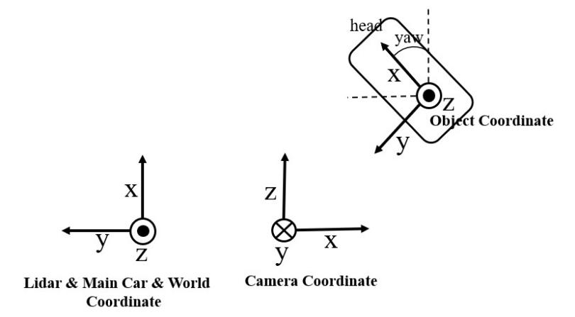
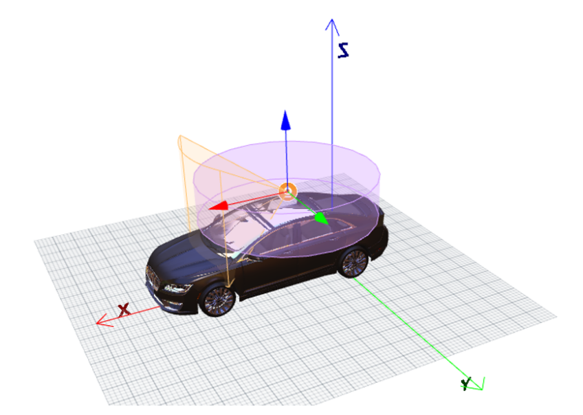

# 51WORLD虚拟标注数据集使用文档

## 1. 引言

在51WORLD虚拟标注数据集中，主要包含由51Sim-One所产生的摄像头传感器相关数据和激光雷达传感器相关数据。摄像头传感器相关数据主要包括图像和对应的语义分割、实例分割、深度标注、目标检测标注；激光雷达传感器相关数据主要包括激光点云和对3Dbboxes标注、语义分割标注、实例分割标注。51WORLD虚拟标注数据集内容丰富且全面，可满足用户对于图像目标检测、点云目标检测、融合目标检测、光流、实例分割、语义分割和深度预测等算法研究的需求。为了帮助用户快速了解和使用51WORLD虚拟标注数据集，本文将通过5个章节来介绍51WORLD虚拟标注数据集的使用方法。第二节将介绍51WORLD虚拟标注数据集的坐标系定义和各个坐标系的对应关系；第三节将介绍数据集的一些参数配置和标注文件；第四节将介绍数据集的目录结构；第五节将介绍该数据集同步；第六节为附录，将介绍数据集的物理材质定义、用户工具和深度学习示例。

## 2. 数据集坐标系定义

其中所有坐标系都为右手笛卡尔坐标系，旋转顺序为内旋ZYX(Yaw, Pitch, Roll)。主车坐标系、激光雷达坐标系和世界坐标系为X朝前、Y朝左、Z朝上，摄像头坐标系为X朝右、Y朝下、Z朝前。坐标系示意图如下。



**2-1** **坐标系示意图**

Lidar坐标系和Camera坐标系的原点都位于主车的车顶，且位置重合；主车坐标系的原点位于主车后轴中心对应的地面。示意图如下:



**图2-2 坐标系位置图**

## 3. 数据集参数及标注文件说明

### 3.1 数据集采集参数说明

在每份虚拟数据集采集的时候都会保存一份数据集的参数设置在DumpSettings.json中。其中包含天气及环境参数、相机内外参及特性参数、激光雷达的内外参和采集时间等信息。数据集采集参数描述如下表：

**表3-1 DumpSettings的参数说明**

|  **参数字段**  |                           **单位**                           | **描述**                                                     |
| :------------: | :----------------------------------------------------------: | :----------------------------------------------------------- |
| **simulator**  |                              \                               | 仿真器名称，本数据集由51Sim-One产生                          |
|  **version**   |                              \                               | 51Sim-One的版本号                                            |
|  **weather**   | timeOfDay为24h制的时间，如900表示9:00，1450表示14:30。cloudDensity、rainDensity、showDensity、fogDensity、humidity、dirtiness、adhesion均为0-1的连续值，值越大表示程度越高。 | 天气参数与时间参数。其中包括timeOfDay(场景时间)、cloud Density、rainDensity、showDensity、fogDensity、humidity (地面潮湿度)、dirtiness(地面脏迹)、adhesion(地面摩擦力) |
|   **camera**   |                pos的单位为m；rot的单位为rad。                | 摄像头的内外参信息。pos、rot分别表示相机相对主车坐标系的位置和旋转，height、width表示图像长宽；fov表示相机的水平视野张角，cx、cy、fx、fy表示相机的标定内参；exposure、tint、saturation 等其他参数用于模拟相机的特性，如曝光特性、色温特性、饱和度特性等。 |
|   **lidar**    | pos的单位为m；rot的单位为rad；range的单位为m；horizontalResolution、leftAngle、rightAngle、verticalAngles的单位均为角度。 | 激光雷达的内外参信息。pos、rot分别表示相机相对主车坐标系位置和旋转，channels表示激光雷达的线数，horizontalResoluti表示激光雷达的水平分辨率、leftAngle和rightAngle表示感知范围、verticalAngles表示激光雷达每条射线的出射角度，range表示探测距离。 |
| **createTime** |                        单位为机器时间                        | 用于记录创建该数据集的时间。                                 |

### 3.2 摄像头目标标注文件说明

摄像头目标标注文件存放在image_label文件夹中，这些文件保存了摄像头的位姿信息和目标二维、三维的标注信息。摄像头目标标注文件的描述如下：

**表3-2 每一帧记录参数信息表**

|     参数字段     | 单位  | 描述                                 |
| :--------------: | :---: | :----------------------------------- |
|     **pos**      |   m   | 摄像头在世界坐标系（x、y、z）的坐标  |
|     **rot**      |  rad  | 摄像头在世界坐标系的旋转坐标         |
|     **vel**      |  m/s  | 摄像头在世界坐标系中的速度           |
|   **localACC**   | m/s^2 | 主车坐标系下的IMU加速度信息          |
| **localAngVel**  | rad/s | 主车坐标系下的IMU角速度信息          |
|    **bboxes**    |   \   | 小于遮挡比例所有目标的2d包围框集合   |
| **bboxesCulled** |   \   | 大于遮挡比例的所有目标的2d包围框集合 |
|   **bboxes3D**   |   \   | 所有目标的3d包围框集合               |

**表3-3 bboxes和bboxesCulled单个目标参数信息表**

| **参数字段**  |   **单位**    | **描述**                                                  |
| :-----------: | :-----------: | :-------------------------------------------------------- |
|    **id**     |       \       | 目标的ID                                                  |
|   **type**    |       \       | 目标的类型                                                |
|   **bbox**    |     pixel     | 目标在图像坐标系的坐标（左上x和y, 右下x和y）              |
|   **obbox**   |     pixel     | 目标在图像系中的方向坐标（中心坐标、长、宽、方向）        |
| **pixelRate** | 比例，范围0-1 | 未被遮挡的像素的面积/模型整体的BBOX矩形面积               |
| **rectRate**  | 比例，范围0-1 | 未被遮挡的像素的最小包围矩形的面积/模型整体的BBOX矩形面积 |

**表3-4 bboxes3D单个目标参数信息表**

|  **参数字段**   | **单位** | **描述**                          |
| :-------------: | :------: | :-------------------------------- |
|     **id**      |    \     | 目标的ID                          |
|    **type**     |    \     | 目标的类型                        |
|     **pos**     |    m     | 目标在世界坐标系所处的坐标        |
|     **rot**     |   rad    | 目标在世界坐标系的旋转坐标        |
|    **size**     |    m     | 目标的在世界坐标系中的长、宽、高  |
|     **vel**     |   m/s    | 目标在世界坐标系中的加速度        |
|  **localAcc**   |  m/s^2   | 目标在主车坐标系下的IMU加速度信息 |
| **localAngVel** |  rad/s   | 目标在主车坐标系下的IMU角速度信息 |
| **relativePos** |    M     | 目标相对于摄像头坐标系的坐标      |
| **relativeRot** |   Rad    | 目标相对于摄像头坐标系的旋转坐标  |

### 3.3 激光雷达目标标注文件说明

激光雷达目标标注文件存放在pcd_label中，这些文件保存了激光雷达的位姿信息和三维的标注信息。激光雷达目标标注文件的描述如下：

**表3-5 每一帧记录参数信息表**

|  **参数字段**   | **单位** | **描述**                              |
| :-------------: | :------: | :------------------------------------ |
|     **pos**     |    m     | 激光雷达在世界坐标系（x、y、z）的坐标 |
|     **rot**     |   rad    | 激光雷达在世界坐标系的旋转坐标。      |
|     **vel**     |   m/s    | 激光雷达在世界坐标系中的速度          |
|  **localAcc**   |  m/s^2   | 主车坐标系下的IMU加速度信息           |
| **localAngVel** |  rad/s   | 主车坐标系下的IMU角速度信息           |
|  **bboxes3D**   |    \     | 所有目标的3d包围框集合                |

**表3-6 bboxes3D单个目标参数信息表**

|  **参数字段**   | **单位** | **描述**                           |
| :-------------: | :------: | :--------------------------------- |
|     **id**      |    \     | 目标的ID                           |
|    **type**     |    \     | 目标的语义类型                     |
|     **pos**     |    m     | 目标在世界坐标系所处的坐标         |
|     **rot**     |   rad    | 目标在世界坐标系的旋转坐标         |
|    **size**     |    m     | 目标的在世界坐标系中的长、宽、高   |
|     **vel**     |   m/s    | 目标在世界坐标系中的加速度         |
|  **localAcc**   |  m/s^2   | 目标在主车坐标系下的IMU加速度信息  |
| **localAngVel** |  rad/s   | 目标在主车坐标系下的IMU角速度信息  |
| **relativePos** |    m     | 目标相对于激光雷达坐标系的坐标     |
| **relativeRot** |   rad    | 目标相对于激光雷达坐标系的旋转坐标 |

## 4. 数据集目录结构说明

51WORLD虚拟标注数据集中包含种类相当丰富的数据，可满足用户对于图像目标检测、点云目标检测、融合目标检测、光流、实例分割、语义分割和深度预测等算法研究的需求。数据集的总体目录结构如下，用户也可以根据自己的需求去下载相应的数据集。

```json
51Sim-One
    |--- train
        |--- scene1
            |---image_label 
            |---pcd_label 
            |---pcd_bin  
            |---image
            |---image_segmentation
            |---depth
            |---image_instance
            |---flow_flagbit_forward
            |---flow_groundtruth_forward
            |---flow_flagbit
            |---flow_groundtruth
            |---flow_panoptic
            |---video
            |---DumpSettings.json
        |--- scene2
        ...
    |--- test
        |---scene1
            |---pcd_bin
            |---image
            |---video
            |---DumpSettings.json
        |--- scene2
        ...
```

各级目录和文件的解释如下：

**表4-1 文件夹与文件描述**

|    文件名 / 文件夹名     | 描述                                                         |
| :----------------------: | :----------------------------------------------------------- |
|          scene           | 用于记录数据发布的时间或者包含场景信息                       |
|       image_label        | 存放图像目标标注文件                                         |
|        pcd_label         | 存放点云目标标注标签                                         |
|         pcd_bin          | 存放点云二进制数据，包含点云的x, y, z, intensity信息         |
|          image           | 存放仿真的图像数据                                           |
|    Image_segmentation    | 存放图像语义分割数据，像素值1-31分别代表一种类别             |
|          depth           | 存放深度图                                                   |
|      image_instance      | 存放图像实例分割图，每种颜色代表一类                         |
|   flow_flagbit_forward   | 存放前向光流标注位，用以标注对应像素点的光流有效性。文件以二进制int8形式存储，flagbit为0则说明该像素点为有效光流，为1则表示光流超出范围，为2则表示被遮挡了。 |
| flow_groundtruth_forward | 存放前向光流的真值，以float32的形式存储，每个像素点对应两个channel，channel[0]表示帧间x方向偏移，channel[1]表示帧间y方向偏移。 |
|       flow_flagbit       | 存放后向光流标注位，用以标注对应像素点的光流有效性。文件以二进制int8形式存储，flagbit为0则说明该像素点为有效光流，为1则表示光流超出范围，为2则表示被遮挡了。 |
|     flow_groundtruth     | 存放后向光流的真值，以float32的形式存储，每个像素点对应两个channel，channel[0]表示帧间x方向偏移，channel[1]表示帧间y方向偏移。 |
|      flow_panoptic       | 存放全景分割的图像，以颜色区分类别                           |
|          video           | 存放视频及标签，标签通过将时间戳与视频帧进行对应             |
|    DumpSettings.json     | 存放数据集下载时的一些参数配置，如相机的内外参等             |

## 5. 数据集同步

传感器数据集采用离线同步的方式。当传感器采用相同帧率或倍数帧率输出数据集时，所有传感器的输出会严格时间同步。在51WORLD虚拟标注数据集中，每个类型的数据都是完全同步的，精确到每一辆车的位置和朝向、每一个行人的姿态和动作。同样利用51Sim-One的传感器数据集同步机制，摄像头和激光雷达数据也可以做到完全同步，这点可以从前面的激光雷达仿真效果展示可以看到。基于完全同步的摄像头和激光雷达数据集，我们可以更方便的做感知融合算法的测试和训练。

## 6. 附录

### 6.1 用户工具

为方便用户使用数据集，我们提供了两个工具，分别是数据加载工具和kitti转化工具。详见user_tools文件夹。

### 6.2 物理材质

本数据集标注了动静态障碍物、建筑物和环境信息等31个物理材质。物理材质及其对应的编号，颜色如下表:

**表6-1 51WORLD数据集物理材质**

| **Id** |  **物理材质**  | **资源**                                                     |   **RGB**   |
| :----: | :------------: | ------------------------------------------------------------ | :---------: |
|   1    |    Foliage     | 树、灌木、相对较高的花                                       | 107,142,35  |
|   2    |    Building    | 各类建筑物                                                   |  70,70,70   |
|   3    |      Road      | 行车道                                                       | 128,64,128  |
|   4    |   Pedestrian   | 行人，行人身上的小物品：如手机、背包和手提箱                 |  220,20,60  |
|   5    |      Pole      | 交通牌或交通灯的杆子、带杆子的路灯、其他地面管状杆子         | 153,153,153 |
|   6    |      Car       | 小汽车                                                       |   0,0,142   |
|   7    |     Static     | 未分类的静态物体：如路边公交站台、电话亭等                   |    0,0,0    |
|   8    |    Bicycle     | 路上的动态自行车                                             |  119,11,32  |
|   9    |     Fence      | 栅栏、建筑物围栏                                             | 190,153,153 |
|   10   |      Sky       | 天空                                                         | 70,130,180  |
|   11   |    SideWalk    | 人行道                                                       | 244,35,232  |
|   12   |    RoadMark    | 车道线                                                       | 240,240,240 |
|   13   |  TrafficSign   | 交通牌、指示牌                                               |  220,220,0  |
|   14   |      Wall      | 围墙                                                         | 102,102,156 |
|   15   |  TrafficLight  | 交通灯                                                       | 250,170,30  |
|   16   |    Terrain     | 草地、沙地、泥地、路边花坛地、花坛中矮小的花                 | 152,251,152 |
|   17   |     Rider      | 自行车上的人、摩托车上的人                                   |   255,0,0   |
|   18   |     Truck      | 卡车、搅拌车、箱式货车                                       |   0,0,70    |
|   19   |      Bus       | 客车、大巴车                                                 |  0,60,100   |
|   20   | SpecialVehicle | 特殊车辆：警车、救护车、消防车、火车，轻轨等                 |  0,80,100   |
|   21   |   Motorcycle   | 摩托车、电瓶车                                               |   0,0,230   |
|   22   |    Dynamic     | 未分类的动态物体，比如小动物，也可用来标记可移动物体，如路边的临时桌椅，行人的手提箱、婴儿车 |  111,74,0   |
|   23   |   GuardRail    | 交通栏杆                                                     | 180,165,180 |
|   24   |     Ground     | 其他平地，水面                                               |   81,0,81   |
|   25   |     Bridge     | 桥梁、高架桥、天桥                                           | 150,100,100 |
|   26   | SpeedLimitSign | 限速牌                                                       |  220,220,0  |
|   27   | StaticBicycle  | 路边的静态自行车                                             |  169,11,32  |
|   28   |    Parking     | 停车场、路边停车区域                                         | 250,170,160 |
|   29   |  RoadObstacle  | 路上的静态障碍物：交通锥、水马、雪糕筒、隔离栏等             | 230,150,140 |
|   30   |     Tunnel     | 隧道                                                         | 150,120,90  |
|   31   |    TrashCan    | 垃圾桶                                                       |  151,124,0  |

### 6.3算法示例

本数据提供了三个简单的算法示例，分别是图像目标检测算法、激光雷达目标检测算法和融合目标检测算法。其中目标检测算法为一个非官方实现的YOLOv2算法，激光雷达目标检测算法为非官方实现的PIXOR算法，融合目标检测算法为mmdetection3d框架中的MVX-NET算法。用户可根据自己的需求，选择算法示例进行开发和优化，提出自己的创新点。详见：

图像目标检测算法：https://github.com/JaHorL/yolov2-51WORLDDataset

激光雷达目标检测算法：https://github.com/JaHorL/pixor-51WORLDDataset

融合目标检测算法及激光雷达目标检测算法(mmdetection3d): https://github.com/JaHorL/mmdet3d-51WORLDDataset